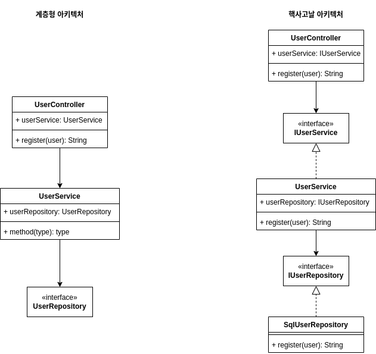

# 계층형 아키텍처와 핵사고날 아키텍처
---

## 1. 계층형 아키텍처
계층형 아키텍처는 상하구조를 기반으로 한 계층형 구조를 정의한다.   
계층형 구조는 데이터 흐름의 관점에서 시스템을 구성하며 전통적인 SQL 데이터의 CRUD 기능 구현과 트랜젝션 처리에 유용한 아키텍처이다.   
명확한 상하구조 아키텍처는 단순한 구성과 일관된 데이터흐름을 만들어 낼수 있어서 파악하기 쉽고 유지보수에도 유리한 점이 있다.   

## 2. 핵사고날 아키텍처
SQL 과 Web/WAS Server 만으로 시스템을 구성할 수 있을때에는 계층형 아키텍처만으로 충분히 사용자 요구사항을 수용할 수 있었다.   
하지만 다양한 서비스 매체와 데이터 저장소, 데이터 분석 도구 들이 도입되면서 App 의 서비스 영역은 복잡해지고 다양해 졌다.   
이런 서비스들은 대부분 처음부터 도입되는 것이 아니라 서비스를 운영하면서 지속적으로 추가되고 변경되게 된다.   
계층형 아키텍처에서는 App 새로운 저장소와 시스템이 도입될때 마다 전체 구조가 변경 되거나 기존 구조에 맞지 않는 구현을 억지로 구겨 넣어야 했다.   
핵사고날 아키텍처는 새로운 기능을 확장할때 전체 구조를 변경하지 않고 변경을 적용하기 위한 아이디어 이다.   
간단한 구현 예제를 보고 장단점을 판단 해 보도록 하자.   

## 3. 아키텍처 비교

한눈에 보기에도 계층형은 단순하고 파악하기 쉽다.
반대로 핵사고날 아키텍처는 UserService 를 중심에 두고 Interface 를 설계하고 구현하는 번거로운 작업을 거쳐야 결과물을 만들어 낼수 있는 구조를 가졌다.   
심지어 위 그림은 구현 단계에서의 느슨한 관계만을 표현한 것이다. 느슨gks 의존관계 구현이 아니라 MSA 구조를 체택해서 구현 상으로 아무런 관계가 없는 구성을 하고 REST API 또는 RPC 만으로 의존 관계를 가지는 한전한 독립형 서비스를 구성하게 되면 전체 시스템을 구성하고 파악하는데 상당한 노력과 지식이 필요하게된다.   
이런 다층적인 구조는 설계 경험과 예외 처리에 대한 다양한 예측이 필요하다.   
또한 하위 도메인을 담당하는 개발자도 시스템에 대한 이해가 필요하며 시스템 표준에서 벗어나는 구현이 생기는 경우 문제점을 인지하고 대응하는데 어려움이 발생한다.   
   
하지만 시스템이 복합적인 구성을 가지게 될 수록 핵사고날 아키텍처의 장점이 두드러진다.   
   
가상의 시나리오로 회원 가입시 대형 특정한 대형 이벤트에서는 SQL 의 부담을 줄이기 위해서 MongoDB 를 도입한는 시나리오를 구상해 보자.   

계층형 아키텍처에서는 Core 역할의 UserService 중심으로 봤을때 Core 가 하위 계층의 구현체를 직접 적으로 알고 있어야 하기 때문에 UserService 의 수정이 불가피 하다.   
핵사고날 아키텍처에서는 UserService 가 Interface 를 통한 간접 참조를 하고있기 때문에 Core 의 직접적인 수정없이 새로운 저장소 기능을 추가 할 수 있다.   
   
물론 실제의도 App 이 작동 하기위해서는 추가적인 작업이 필요하다.   
하지만 추가작업이 필요하다고 해도 핵사고날 아키텍처는 Core 계층의 수정 사항을 최소화 하기에 확장에 대한 여파를 최소화 할 수 있다.   

## 4. 결론
새로운 기술을 도입 할 때는 항상 좋은 점만을 생각하게 된다.   
하지만 아직까지는 만능의 기술은 존재 하지 않는다.   
계층형 아키텍처는 단순하고 빠르게 목표를 이룰수 있다는 장점이 있지만 확장과 변경에 닫혀 있어서 확장 비용이 오히려 더 많이 들 수 있다는 단점이 있다.   
핵사고날 아키텍처가 확장과 변경에 대해서 많은 장점을 제공하지만 그만큼의 추가비용(시간과 인력)이 필요하며 충분한 학습 곡선과 계획이 필요하다는 단점이 존재한다.   
   
누군가는 둘중에 하나를 선택하는 명쾌한 답을 원했을 것이다.   
하지만 결론은 현재 이루고자 하는 목표에 맞는 방법을 선택해야 한다는 뻔한 답변 뿐이다.   
수단이 문제가 아니라 무엇을 이루 고자 하는지 목적을 생각 해야 한다.
